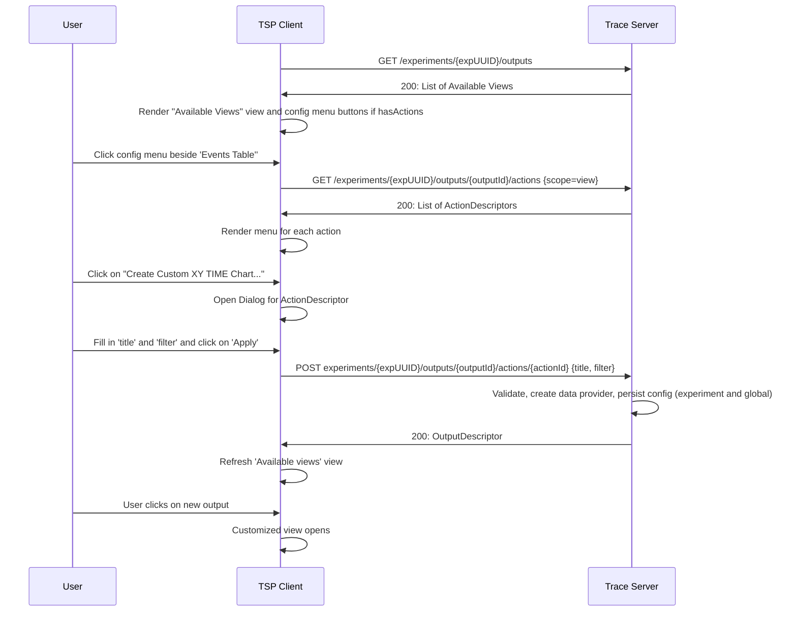

# 11. Tsp analysis api

Date: 2023-06-20

## Status

Proposed
Version v2

## Context

The trace viewer currently is able to visualize trace data provided by a trace server over the trace server protocol (TSP). The Trace Compass server has some built-in analysis view for that. However, it is not possible to side-load analysis and visualization descriptions over the TSP so that end-user can provide some custom views. The Trace Compass supports loading of data-driven analysis and views, e.g. XML driven views or in-and-out anlysis of the Trace Compass incubator project. In the Eclispe-based Trace Compass application, there exists UI primitive to load e.g. XML files or configure custom analysis. While the Trace Compass server has the capablility to understand these defintions, there is no way to side-load this definition over the TSP. This ADR will propose a configuration service within the TSP to facilitate these custom analysis. The proposed configuration service can be use to configure other server specific customization, e.g. custom trace parsers.

### Global configuration service

An analysis service for managing global configurations will be introduced. Global in this context means that the configuration definitions will be handled on the application level. 

    GET /config/types
            returns a list of configuration source types: typeId, name, description, scope, expected parameter descriptors (e.g. "path" for file path)
    GET /config/types/{typeId}
            returns a single configuration source type for given typeId: typeId, name, description, scope, expected parameter descriptors (e.g. "path" for file path)
    GET /config/types/{typeId}/configs
        returns a list of configuration instances for a given typeId
    POST /config/types/{typeId}/configs
        Upload an configuration definition for given typeId
        Returns a new configuration descriptor with unique configuration ID
    PUT /config/types/{typeId}/configs/{configId}
        Update a configuration
    GET /config/types/{typeId}/configs/{configId}
        Returns the configuration descriptor for given configId and typeId
    DELETE /config/types/{typeId}/configs/{configId}
        Delete a configuration instance

#### Configuration source type descriptor

The configuration source type descriptor describes the type of external configuration. Different types have different syntax and hence back-end implementation. This descriptor is used to distinquish the different external configurations. The trace server implementation will provide the list of type descriptors on client requests.
```javascript
ConfigurationSourceType {
    name: string,
    description: string,
    id: string,
    scope: string,
    parameterDescriptors: ConfigurationParameterDescriptor[]
}
```

Where:

- `name`: Name of the configuration source type. Can be shown to the end-user.
- `description`: The description of the configuration source type. Can be shown to the end-user.
- `id`: Unique id of the configuration source type. Used in the application to distinquish configuration source types
- `scope:` `experiment` for configuration source types per experiment or `global` for all experiments
- `parameterDescriptors`: A list of descriptors that describe the parameters that the front-end needs to provide with corresponding values. For example, use "path" for file path.

#### Configuration parameter descriptor

The configuration parameter descriptor describes a parameter that the front-end needs to provide with corresponding values. This descriptor will help implementing a UI for the parameters.

```javascript
ConfigurationParameterDescriptor {
    keyName: string,
    description: string,
    dataType: string,
    isRequired: bool
}
```

Where:

- `keyName`: Name of the key to use in the parameter map.
- `description`: The description of the configuration parameter. Can be shown to the end-user.
- `dataType`: A data type hint to the client. Helps implementing validation of values in the front-end.
- `isRequired`: A flag indicating whether parameter is required or not.

#### Configuration descriptor

The configuration descriptor describes an instance of an external configuration for a given source type. This descriptor is used to distinquish the different external configurations for a given type.

```javascript
Configuration {
    name: string,
    description: string,
    id: string,
    sourceTypeId: string
    parameters: map<string, object>
}
```

Where:
- `name`: Name of the configuration. Can be shown to the end-user.
- `description`: The description of the configuration. Can be shown to the end-user.
- `id`: Unique id of the configuration. Used in the application to distinquish the configurations
- `sourceTypeId`: ID of the configuration source type.
- `parameters`: An optional map of parameters to show to the users of the configuration

#### Sequence: Create configuration instance

The following illustrates the sequence of events and messages to create an instance of an external configuration for a given type (e.g. XML analysis).


#### Sequence: Update configuration instance

The following illustrates the sequence of events and messages to update an existing instance of an external configuration for a given type (e.g. XML analysis).


Note: If traces are open, the trace server has to take care of refreshing the back-end data structures (e.g. state systems). The client also needs to refresh the UI.

#### Sequence: Delete analysis instance

The following illustrates the sequence of events and messages to delete an existing instance of an external analysis for a given type (e.g. XML analysis).


### Configuration service per experiment

See [Updated API poposal](#updated-api-poposal) for newer, augmented proposal to this chapter.

For this data provider service will be augmented for managing configurations per experiment.

    GET experiments/{expUUID}/outputs/config
        returns a map typeId -> list of configuration descriptors of existing configurations on server
    POST experiments/{expUUID}/outputs/config
        Assign configuration to an experiment using typeId and configId from above.
        Returns configuration descriptor and list of data provider descriptors (if available)
    DELETE experiments/{expUUID}/outputs/config/{configId}
        Removes a configuration from an experiment

#### Sequence: Create configuration instance for an experiment

The following illustrates the sequence of events and messages to create an configuration instance for a given type and experiment. It uses the Trace Compass In-And-Out as example. Note, that the configuration is provided using a file.

Pre-requisite: Configuration instance created as described in [Sequence: Create configuration instance](#sequence-create-configuration-instance).


#### Sequence: Delete configuration instance for an experiment

The following illustrates the sequence of events and messages to delete an configuration instance for a given type and experiment.

Pre-requisite: Analysis instance created as described in [Sequence: Create configuration instance for an experiment](#sequence-create-configuration-instance-for-an-experiment).


### Future considerations
The proposal requires the input of the configuration be a file that needs to be provided to the trace server. This works well, however a generic front-end cannot provide a UI implementation for creating such a file with the correct syntax. Custom client extensions implementation can be implemented for that. Also, JSON forms could be used for JSON based input.

### Implementation steps

 Use configuration using file by default for external configuration. This will allow to have a generic UI implementation in `theia-trace-extension` for that. 
 The following list provides a break down in different implementation steps. This doesn't inlcude effort for the Python client.

- Configuration Service
    - TSP updates for configuration service
    - Back-end: Configuration Service (TSP) skeleton
    - Back-end: Trace Compass Server back-end API for configuration source types
    - Back-end: Trace Compass Server back-end API for XML analysis
    - Back-end: Use Trace Compass Server back-end API in Configuration Service
    - Front-end: tsp-typescript-client updates
    - Front-end: Implement simple manager UI for files per typeID (re-usable react component)
- Data provider configuration service (InAndOut)
    - TSP updates for data provider configuration service
    - Back-end: Data provider configuration service (TSP) skeleton
    - Back-end: Implement support for InAndOut configuration
    - Front-end: tsp-typescript-client updates
    - Front-end: Add UI to apply configuration to experiment (in react-component)

## Decision

The change that we're proposing or have agreed to implement, will be implemented.

## Consequences

### Easier to do

This will introduce new TSP endpoints and it's a completely new feature for trace viewers supporting supporting these endpoints in the front-end and server back-end. Once implemented, it will greatly enhance the feature capabilities of the whole application. It will help end-users to define their custom analysis and visualization definitions as well as other server side configurations, and allow them to get such features faster than having to write code in the server application, compile and re-deploy the server afterwards. This will reduce troubleshooting times for the end-users.

### More difficult

Having new TSP endpoints will make the TSP more complicated to use, and interested front-end / back-end implementations need to follow. A TSP will become larger and will need to be maintained.

### Risks introduced

The TSP will be bigger and more APIs need to be maintained on all levels of the client-server application.

### Updated API poposal

The update API proposal augments the `OutputDescriptor`, and `ConfigurationSourceType`, as well as and adds new data structures, `ActionDescriptor` and `ExtraQueryParameter` to allow for more flexibility in supporting more use cases to configure new (clone data providers), other existing data provider or own data provider.

**Updated or new data structures**

```javascript
    OutputDescriptor {
        id: string,
        name: string,
        description: string,
        type: string,  // provider type
        // new parameter
        hasActions?: boolean // optional, default false
    }
```

```javascript
ActionDescriptor {
    name: string,
    description: string,
    id: string,
    scope: string, // view, self, tree, graph (location of action)
    isToggle?: boolean, // for toggle button
    configType: ConfigurationSourceType
}
```
**TODO: ActionDescriptors need a way to group, have sub-menus and where to put it (e.g. before/after)**

```javascript
ConfigurationSourceType {
    name: string,
    description: string,
    id: string,
    scope: string,
    parameterDescriptors: ConfigurationParameterDescriptor[] // schema
}
```
Note, consider replacing `parameterDescriptors: ConfigurationParameterDescriptor[]` with a [JSON schema](https://json-schema.org/).

```javascript
ConfigurationParameterDescriptor { 
    keyName: string,
    description: string,
    dataType: string,
    isRequired: bool
}
```

```javascript
ExtraQueryParameter {
    param: { [key: string]: string }  // map string -> string to avoid issues with timestamp
}
```

### Examples use case realizations using actions

#### Example Custom Flame Chart

```mermaid
sequenceDiagram
    participant user as User
    participant client as TSP Client
    participant server as Trace Server
    client->>server: GET /experiments/{expUUID}/outputs
    server->>client: 200: List of Available Views
    client->>client: Render "Available Views" view and config menu buttons if hasActions
    user->>client: Click config menu beside 'Flame Chart''
    client->>server: GET /experiments/{expUUID}/outputs/{outputId}/actions {scope=view}
    server->>client: 200: List of ActionDescriptors
    client->>client: Render menu for each action
    user->>client: Click on "Custom Flame Charts..."
    client->>client: Open Dialog for ActionDescriptor
    user->>client: Fill in 'title' and 'filter' and click on 'Apply'
    client->>server: POST experiments/{expUUID}/outputs/{outputId}/actions/{actionId} {title, filter}
    server->>server: Validate, create data provider, persist config (experiment and global)
    server->>client: 200: OutputDescriptor
    client->>client: Refresh 'Available views' view
    user->>client: User clicks on new output
    client->>client: Customized view opens
 ```
Notes: 
- Data provider may decide to persist input parameters (configuraton) in global server-wide storage that can be manage through [Global Configuration Service](#global-configuration-service).
- Data provider may return additional actions in List of Action Descriptors for applying existing configs that had been storead in global-wide storage

```javascript
ActionDescriptor {
    "name": Create Custom Flame Chart...,
    "description": Manage instance of a custom flame based on input parameters,
    "id": "custom.flame.charts.id",
    "scope": "view", // self, view, tree, graph (location of action)
    "parameterDescriptors": [
        {
            "keyName": "title",
            "description": "Provide a name of custom flame chart to be shown in UI",
            "dataType": "string",
            "isRequired": "true"
        },
        {
            "keyName": "filter",
            "description": "Provide a filter string according to filter language",
            "dataType": "string",
            "isRequired": "true"
        }
    ]
}
```

```javascript
OutputDescriptor {
    "id": "flamechart.id",
    "name": "Flame Chart",
    "description": "Flame Chart description",
    "type": "TIME_GRAPH",
    "hasActions": "true" // To avoid querying each data provider one-by-one
}
```

`User input`:
```javascript
    {"title": "CPU 0-1 only", "filter": "cpu matches [0-1]"}
```

`"New Descriptor"`

```javascript
OutputDescriptor { 
        "id": "custom.callstack.id",
        "name": "CPU 0-1 only",  // name of configuration
        "description": "Custom call stack 'CPU 0-1 only' ", // description of cofiguration
        "type": "TIME_GRAPH",
        "hasActions": "true"   // for delete, data provider action
    }
```

**Questions**
- How to delete data provider? 
    - New data provider descriptor will have action to remove data provider. 
- How list configuration? 
    - Source data provider will have action to apply existing configurations on server
    - User can use [Global configuration service](#global-configuration-service) to list configurations
- How to export/import config
    Use [Global configuration service](#global-configuration-service) to list configurations

-----------------------------------------------------------------------------------------------------
-----------------------------------------------------------------------------------------------------
#### Example: Critical Path

```mermaid
sequenceDiagram
    participant user as User
    participant client as TSP Client
    participant server as Trace Server
    client->>server: GET /experiments/{expUUID}/outputs
    server->>client: 200: List of Available Views
    client->>client: Render "Available Views" view and config menu buttons if hasActions
    user->>client: User selects "Thread Status View"
    Note right of user: Thread Status view opens
    user->>client: Right-mouse click on thread in tree
    client->>server: GET /experiments/{expUUID}/outputs/{outputId}/actions {scope=tree}
    server->>client: 200: List of ActionDescriptors
    client->>client: Render view menu for each action with entry 'Follow Thread"
    client->>server: POST experiments/{expUUID}/outputs/{outputId}/actions/{actionId} {requested_items=[{itemId}]}
    server->>server: Validate, create custom query parameter
    server->>client: 200: ExtraQueryParameter
    client->>client: Refresh 'Available views' view
    user->>client: User clicks on new output
    client->>client: Customized view opens
 ```

```javascript
ActionDescriptor {
    "name": Follow Thread,
    "description": Follows a selected thread,
    "id": "thread.filter.id",
    "scope": "tree", // self, view, tree, graph (location of action)
    "parameterDescriptors": [
        {
            "keyName": "requested_items",
            "description": "ids of requested_itmes",
            "dataType": "None",
            "isRequired": "true"
        }
    ]
}
```

```javascript
OutputDescriptor {
    "id": "thread.status.id",
    "name": "Thread Status",
    "description": "Thread Status description",
    "type": "TIME_GRAPH",
    "hasActions": "true"
}
```

`Context sensitive menu on tree of "Thread Status View"`: `"Follow Thread"` 
`User input by selection and not dialog`:
`Don't allow multiple`


```javascript
ExtraQueryParameter {
    "param": {
        "name": "MyThread", 
        "tid": "1234",
        "hostId: "hostID"
    }
}
OutputDescriptor {
    "id": "critical.path.id",
    "name": "Critical Path",
    "description": "Critical path description",
    "type": "TIME_GRAPH",
    "hasActions": "true" // to unfollow
}
```

Note:
    - `param` needs to replaced by something specific to follow thread
    - Extra query param are added to all data provider queries of returned data provider
    - If user sends it again, old filter is replaced

-------------------------------------------------------------------------------
-------------------------------------------------------------------------------
#### Example: Active Thread Filters

```mermaid
sequenceDiagram
    participant user as User
    participant client as TSP Client
    participant server as Trace Server
    client->>server: GET /experiments/{expUUID}/outputs
    server->>client: 200: List of Available Views
    client->>client: Render "Available Views" view and config menu buttons if hasActions
    user->>client: Click on 'Thread Status view'
    Note right of user: Thread Status view opens
    user->>client: Click on view menu
    client->>server: GET /experiments/{expUUID}/outputs/{outputId}/actions {scope=self}
    server->>client: 200: List of ActionDescriptors
    client->>client: Render view menu for each action with entry 'Active Threads Filter"
    client->>server: POST experiments/{expUUID}/outputs/{outputId}/actions/{actionId} {isActiveThreadFilter=true, cpu=[0-1]}
    server->>server: Validate, create extra query parameters
    server->>client: 200: ExtraQueryParameter
    client->>client: Refresh tree and graph view
 ```

```javascript
ActionDescriptor {
    "name": "Active Thread Filter",
    "description": "Show only active threads for all or selected cpus",
    "id": "active.thread.filter.id",
    "scope": "self", // self, view, tree, graph (location of action)
    "parameterDescriptors": [
        {
            "keyName": "isActiveThreadFilter",
            "description": "Flag to indicate active thread filter",
            "dataType": "boolean",
            "isRequired": "true"
        },
        {
            "keyName": "cpus",
            "description": "list of cpus, e.g. 0 or 0-2, or 0,1,4. If missing all cpus.",
            "dataType": "string",
            "isRequired": "false"
        },
    ]
}
```

```javascript
OutputDescriptor {
    "id": "thread.status.id",
    "name": "Thread Status",
    "description": "Thread Status description",
    "type": "TIME_GRAPH",
    "hasActions": "true"
}
```

```javascript
    {"isActiveThreadFilter": "true", "cpus": "0-1"}
```

```javascript
ExtraQueryParameter {
    "param": {
        "isActiveThreadFilter": "true", 
        "cpus": "[0-1]"
    }
}
```

Note:
    - Toggle button, it will be replaced by previous selection
    - Extra query param are added to all data provider queries of `self` view when button active

-----------------------------------------------------------------------------------------
-----------------------------------------------------------------------------------------
#### Example: XY Chart From Events Table



```javascript
ActionDescriptor {
    "name": Create Custom XY Chart... ,
    "description": Create custom XY chart,
    "id": "custom.xy.time.charts.id",
    "scope": "view", // self, view, tree, graph (location of action)
    "parameterDescriptors": [
        {
            "keyName": "title",
            "description": "title of graph",
            "dataType": "string",
            "isRequired": "true"
        },
        {
            "keyName": "columns",
            "description": "Names of columns to plot",
            "dataType": "array",
            "isRequired": "true"
        },
        {
            "keyName": "filter",
            "description": "Filter condition",
            "dataType": "array",
            "isRequired": "true"
        }
        {
            "keyName": "y-axis",
            "description": "Names of y-axis",
            "dataType": "string",
            "isRequired": "false"
        },
        {
            "keyName": "y-unit",
            "description": "Unit of y-axis",
            "dataType": "string",
            "isRequired": "false"
        },
        {
            "keyName": "y-data-type",
            "description": "data type of y-axis",
            "dataType": "string",
            "isRequired": "false"
        }
    ]
}
```

```javascript
OutputDescriptor {
    "id": "events.table.id",
    "name": "Events Table",
    "description": "Event Table description",
    "type": "TABLE",
    "hasActions: "true"
}
```

`User input`:
```javascript
    {
        "title": "CPU Number Plot", 
        "columns": ["CPU"],
        "filter": "tid==1234",
        "y-axis": "CPU",
        "y-unit": "no-unit",
        "y-data-type": "Number"
    }
```

`New Descriptor`

```javascript
OutputDescriptor { 
    "id": "custom.xy.plot.id.1",
    "name": "CPU Number Plot",
    "description": "Plots the CPU over time for given filter",
    "type": "TREE_TIME_XY",
    "hasActions": "true"  // for delete and modify action
    }
```

**Questions**
- How to delete data provider? 
    - New data provider descriptor will have action to remove data provider. 
- How list configuration? 
    - Source data provider will have action to apply existing configurations on server
    - User can use [Global configuration service](#global-configuration-service) to list configurations
- How to export/import config
    Use [Global configuration service](#global-configuration-service) to list configurations

-------------------------------------------------------------------------------
-------------------------------------------------------------------------------
#### Example: Custom Function Execution Statistics**.

```mermaid
sequenceDiagram
    participant user as User
    participant client as TSP Client
    participant server as Trace Server
    client->>server: GET /experiments/{expUUID}/outputs
    server->>client: 200: List of Available Views
    client->>client: Render "Available Views" view and config menu button if hasActions
    user->>client: Click config menu beside 'Segment Store Statistics''
    client->>server: GET /experiments/{expUUID}/outputs/{outputId}/actions {scope=view}
    server->>client: 200: List of ActionDescriptors
    client->>client: Render menu for each action
    user->>client: Click on "Aggregate..."
    client->>client: Open Dialog for ActionDescriptor
    user->>client: Fill in 'title', 'filter' and click on 'Apply'
    client->>server: POST experiments/{expUUID}/outputs/{outputId}/actions/{actionId} {title, filter}
    server->>server: Validate, create data provider, persist config (experiment and global)
    server->>client: 200: OutputDescriptor
    client->>client: Refresh 'Available views' view
    user->>client: User clicks on new output
    client->>client: Customized view opens
 ```

```javascript
[
    ActionDescriptor {
        "name": Aggregate...,
        "description": Manages Custom Function Duration Statistics,
        "id": "custom.fct.duration.stats.id",
        "scope": "view", // self, view, tree, graph (location of action)
        "parameterDescriptors": [
            {
                "keyName": "title",
                "description": "title of graph",
                "dataType": "string",
                "isRequired": "true"
            },
            {
                "keyName": "filter",
                "description": "Aggregate stats for functions matching regex",
                "dataType": "string",
                "isRequired": "true"
            }
        ]
    },
    ActionDescriptor {
        "name": Create custom view...,
        "description": Creates a custom Function Duration Statistics view based on input regex filter to include/exclude functions.
        "id": "custom.fct.duration.stats.id",
        "scope": "view", // self, view, tree, graph (location of action)
        "parameterDescriptors": [
            {
                "keyName": "filter",
                "description": "Regex filter on function names.",
                "dataType": "string",
                "isRequired": "true"
            }
        ]
]
```

```javascript
OutputDescriptor {
    "id": "segmentstore.latency.analysis.statistics:callstack.analysis",
    "name": "Function Execution statistics",
    "description": "Function Execution statistics",
    "type": "DATA_TREE",
    "hasAction": "true"  // 2 actions of above
}
```

`User input`:
```javascript
    {
        "title": "Grouped Stats", 
        "aggregation": "label matches COM.*"
    }
```

`New Descriptor`

```javascript
OutputDescriptor { 
    "id": "segmentstore.latency.analysis.statistics:callstack.analysis:custom.fct.execution.stats.id.instance.1",
    "name": "Grouped Stats",
    "description": "Custom function duration statistics aggregated by name: [COM.*]",
    "type": "DATA_TREE",
    "hasAction": "true"  // for delete, modify actions
    }
```

**Questions**
- How to delete data provider? 
    - New data provider descriptor will have action to remove data provider. 
- How list configuration? 
    - Source data provider will have action to apply existing configurations on server
    - User can use [Global configuration service](#global-configuration-service) to list configurations
- How to export/import config
    Use [Global configuration service](#global-configuration-service) to list configurations


#### Manage configurations

Data provider may decide to persist input parameters (configuraton) in global server-wide storage that can be managed through the [Global Configuration Service](#global-configuration-service). With this configurations can be shared between experiments and users. For that data provider can return additional actions in List of Action Descriptors for applying existing configs that had been stored in the global server-wide storage. To list or delete a persisted configuration in global server-wide storage use the global configuration source endpoint described here [Global configuration service](#global-configuration-service).

### Notes

It would be good that for each domain in server e.g. linux kernel there is a common language so that elements can referenced by the same keys

thread-name
host-id
tid
pid
ppid
cpu
others?


